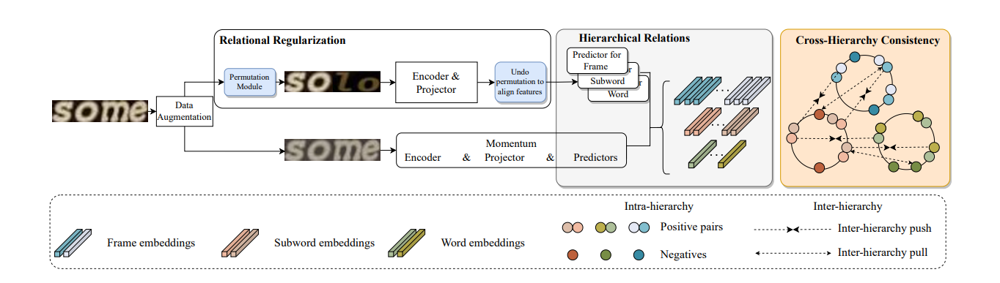
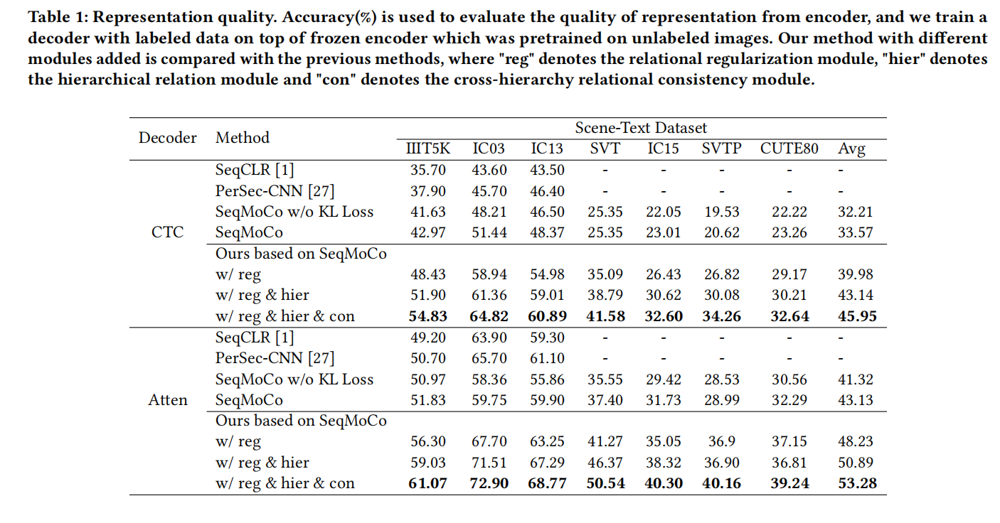

<div align="center">
<h1>RCLSTR</h1>
<h3>[ACMMM 2023] Relational Contrastive Learning for Scene Text Recognition</h3>
</div>

<div align="center">
  
</div><br/>

## Introduction

This repository is an official implementation of [RCLSTR](https://arxiv.org/abs/2308.00508).

## Getting Started

### 1. Environment Setup

#### Base Environments 

Python >= 3.8 \
CUDA == 11.0 \
PyTorch == 1.7.1 

#### Step-by-step installation instructions

**a. Create a conda virtual environment and activate it.**
```shell
conda create -n RCLSTR python=3.8 -y
conda activate RCLSTR
```

**b. Install PyTorch and torchvision following the [official instructions](https://pytorch.org/).**
```shell
pip install torch==1.7.1+cu110 torchvision==0.8.2+cu110 torchaudio==0.7.2 -f https://download.pytorch.org/whl/torch_stable.html
```

**c. Install other packages.**
```shell
pip install lmdb pillow nltk natsort fire tensorboard tqdm imgaug einops
pip install numpy==1.22.3
```

### 2. Data Preparation

**Download datasets**

We use the ST(SynthText) training datasets from [STR-Fewer-Labels](https://github.com/ku21fan/STR-Fewer-Labels/blob/main/data.md). Download the datasets from [baiduyun (password:px16)](https://pan.baidu.com/s/1YHINOUzcoKcnQl9aRaznHg).

**Data folder structure**

```
data_CVPR2021
├── training
│   └── label
│       └── synth
├── validation
│   ├── 1.SVT
│   ├── 2.IIIT
│   ├── 3.IC13
│   ├── 4.IC15
│   ├── 5.COCO
│   ├── 6.RCTW17
│   ├── 7.Uber
│   ├── 8.ArT
│   ├── 9.LSVT
│   ├── 10.MLT19
│   └── 11.ReCTS
└── evaluation
    └── benchmark
        ├── CUTE80
        ├── IC03_867
        ├── IC13_1015
        ├── IC15_2077
        ├── IIIT5k_3000
        ├── SVT
        └── SVTP
```

Link the dataset path as follows:

```
cd pretrain
ln -s /path/to/data_CVPR2021 data_CVPR2021
cd evaluation
ln -s /path/to/data_CVPR2021 data_CVPR2021
```

**TPS model weights**

For the TPS module, we use the pretrained TPS model weights from [STR-Fewer-Labels](https://github.com/ku21fan/STR-Fewer-Labels). Please download the TPS model weights from [baiduyun (password:px16)](https://pan.baidu.com/s/1YHINOUzcoKcnQl9aRaznHg) and put it in pretrain/TPS_model.

### 3. Pretrain and decoder evaluation


#### Pretrain

RCLSTR method includes regularization module (reg), hierarchical module (hier) and cross-hierarchy consistency module (con). 

<details>
 <summary> Pretrain SeqMoCo model:</summary>

```
cd pretrain
CUDA_VISIBLE_DEVICES=0,1,2,3 python main_moco.py   \
--model_name TRBA  \
--exp_name SeqMoCo   \
--lr 0.0015   \
--batch-size 32   \
--dist-url 'tcp://localhost:10002' \
--multiprocessing-distributed \
--world-size 1 \
--rank 0   \
--data data_CVPR2021/training/label/synth  \
--data-format lmdb  \
--light_aug   \
--instance_map window   \
--epochs 5   \
--useTPS ./TPS_model/TRBA-Baseline-synth.pth \
--loss_setting consistent \
--frame_weight 0 \
--frame_alpha 0 \
--word_weight 0 \
--word_alpha 0
```
</details>

<details>
 <summary> Pretrain SeqMoCo model with reg module:</summary>

```
cd pretrain
CUDA_VISIBLE_DEVICES=0,1,2,3 python main_moco.py   \
--model_name TRBA  \
--exp_name SeqMoCo_reg   \
--lr 0.0015   \
--batch-size 32   \
--dist-url 'tcp://localhost:10002' \
--multiprocessing-distributed \
--world-size 1 \
--rank 0   \
--data data_CVPR2021/training/label/synth  \
--data-format lmdb  \
--light_aug   \
--instance_map window   \
--epochs 5   \
--useTPS ./TPS_model/TRBA-Baseline-synth.pth \
--loss_setting consistent \
--permutation \
--frame_weight 0 \
--frame_alpha 0 \
--word_weight 0 \
--word_alpha 0
```
</details>

<details>
 <summary> Pretrain SeqMoCo model with reg and hier module:</summary>

```
cd pretrain
CUDA_VISIBLE_DEVICES=0,1,2,3 python main_moco.py   \
--model_name TRBA  \
--exp_name SeqMoCo_reg_hier   \
--lr 0.0015   \
--batch-size 32   \
--dist-url 'tcp://localhost:10002' \
--multiprocessing-distributed \
--world-size 1 \
--rank 0   \
--data data_CVPR2021/training/label/synth  \
--data-format lmdb  \
--light_aug   \
--instance_map window   \
--epochs 5   \
--useTPS ./TPS_model/TRBA-Baseline-synth.pth \
--loss_setting consistent \
--permutation 
```
</details>

<details>
 <summary> Pretrain SeqMoCo model with reg, hier and con module:</summary>

```
cd pretrain
CUDA_VISIBLE_DEVICES=0,1,2,3 python main_moco.py   \
--model_name TRBA  \
--exp_name SeqMoCo_reg_hier_con   \
--lr 0.0015   \
--batch-size 32   \
--dist-url 'tcp://localhost:10002' \
--multiprocessing-distributed \
--world-size 1 \
--rank 0   \
--data data_CVPR2021/training/label/synth  \
--data-format lmdb  \
--light_aug   \
--instance_map window   \
--epochs 5   \
--useTPS ./TPS_model/TRBA-Baseline-synth.pth \
--loss_setting consistent \
--permutation \
--multi_level_consistent global2local \
--multi_level_ins 0
```
</details>


#### Feature representation evaluation

<details>
 <summary> Train attention-based decoder for feature representation evaluation:</summary>

```
cd evaluation
CUDA_VISIBLE_DEVICES=0 python train_new.py \
--model_name TRA \
--exp_name TRA_reg_hier_con \
--saved_model ../pretrain/SeqMoCo_reg_hier_con/checkpoint_0004.pth.tar \
--select_data synth \
--batch_size 256 \
--Aug light
```
</details>

## Main Results

<div align="center">
  
</div><br/>

## TODO

- [ ] Support ViT 

## Acknowledgements

We thank these great works and open-source codebases:

* [MoCo](https://github.com/facebookresearch/moco)

* [STR-Fewer-Labels](https://github.com/ku21fan/STR-Fewer-Labels)

## Citation
```bash
If you find our method useful for your reserach, please cite

@misc{zhang2023relational,
      title={Relational Contrastive Learning for Scene Text Recognition}, 
      author={Jinglei Zhang and Tiancheng Lin and Yi Xu and Kai Chen and Rui Zhang},
      year={2023},
      eprint={2308.00508},
      archivePrefix={arXiv},
      primaryClass={cs.CV}
}
```

